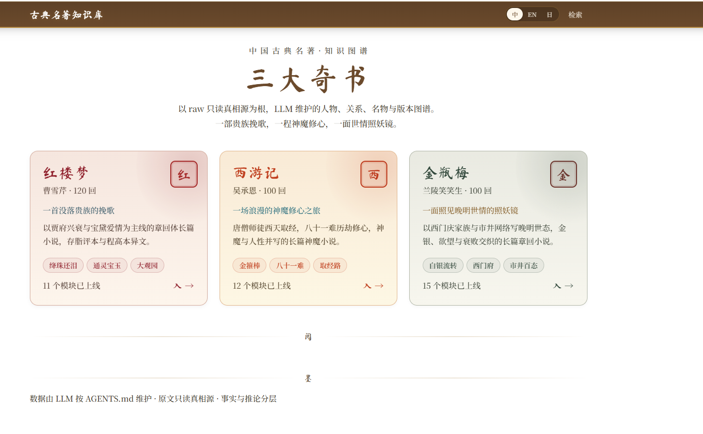
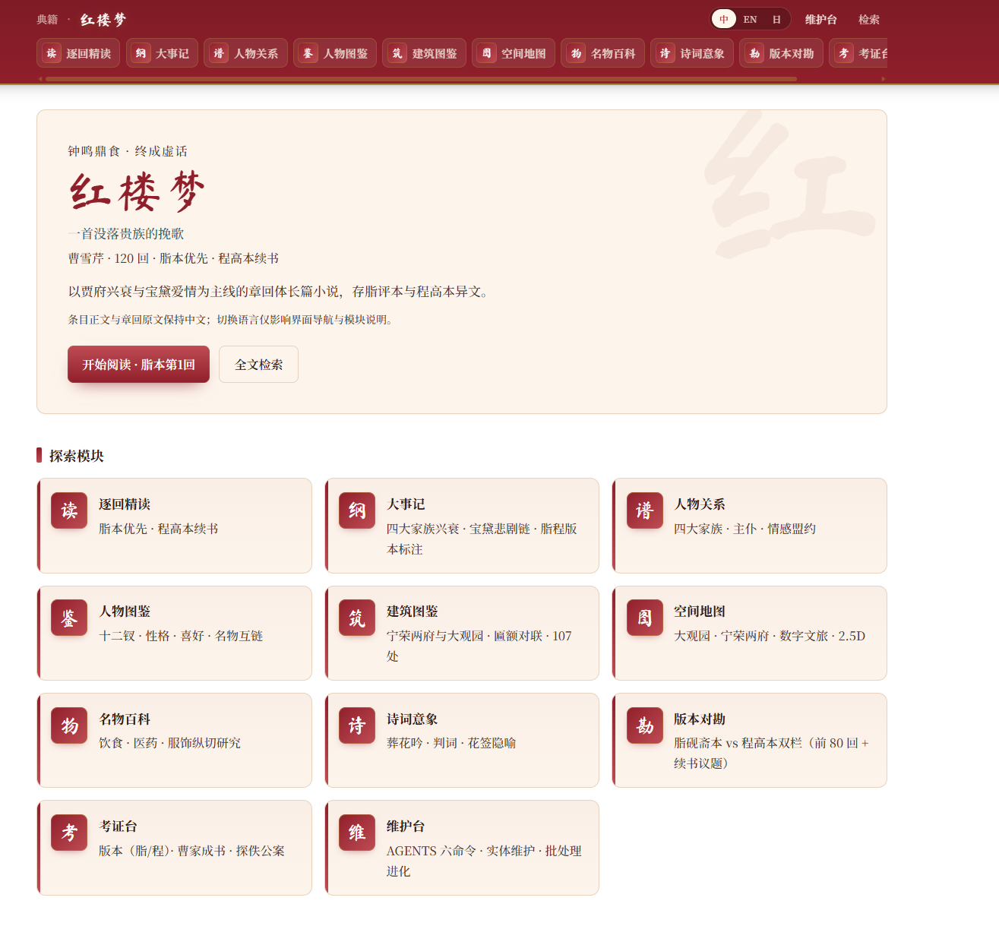
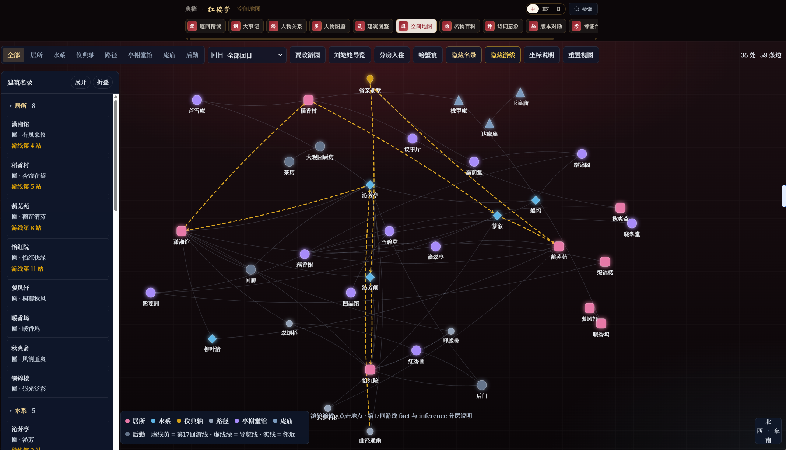
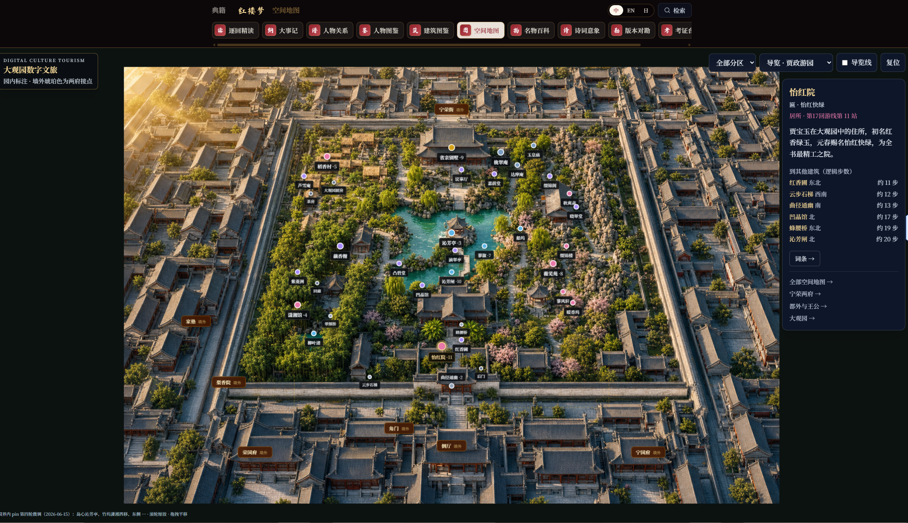
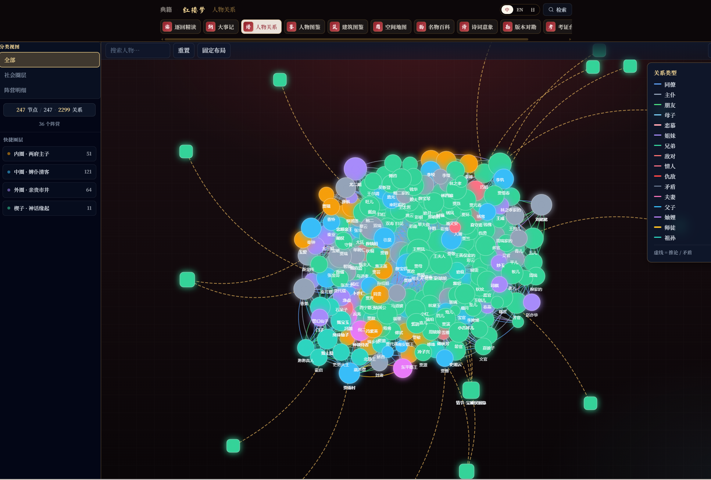
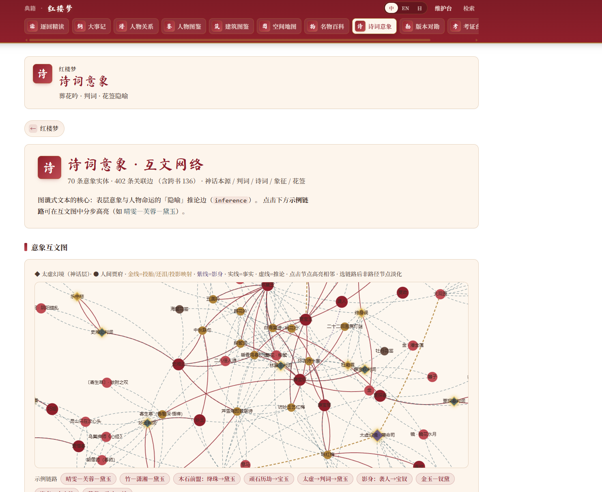
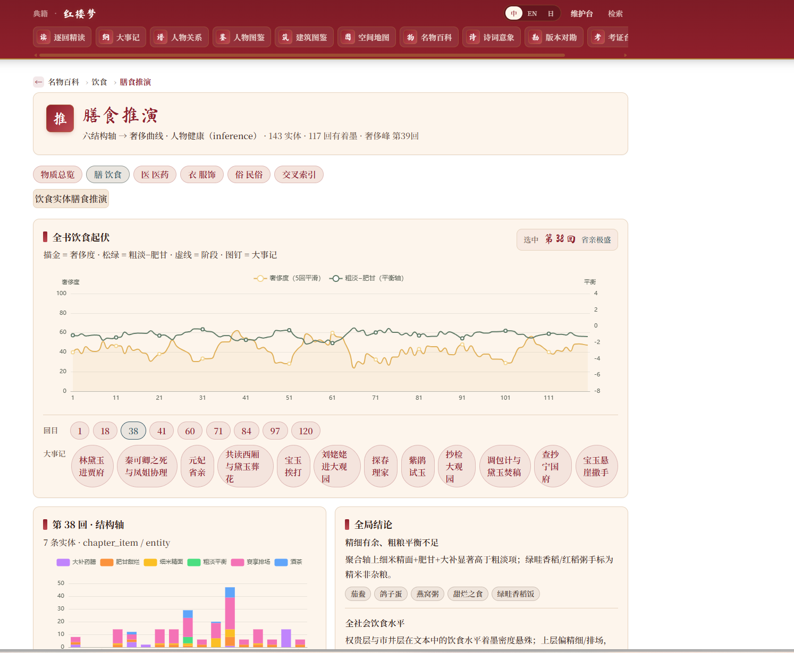

# moli-knowledge-base

**多领域 LLM Wiki 工作区** — 以结构化知识库 + 静态站点，把古典名著做成可检索、可溯源、可演化的数字文献。

**在线演示**：[https://chinese-classical-texts.wu-jinsen.com/](https://chinese-classical-texts.wu-jinsen.com/)

基于 [Karpathy LLM Wiki](https://gist.github.com/karpathy/442a6bf555914893e9891c11519de94f) 模式：原文只读存档，LLM 维护 wiki 实体与关系，构建期强校验，前端静态发布。



---

## 项目简介

`moli-knowledge-base` 是一个面向**长期演进**的智能知识库 monorepo。当前已落地领域为 **中国古籍（chinese-classical-texts）**，覆盖《红楼梦》《金瓶梅》《西游记》三大章回小说。

与传统 Wiki 或纯 RAG 项目的区别：

| 能力 | 说明 |
|------|------|
| **真相源分离** | `raw/` 与 `chapters/` 原文只读；结构化结论写入 `src/content/`，须带出处 |
| **Trust Guard** | 构建脚本校验人物出场、情节锚词、关系边，降低 LLM 幻觉 |
| **关系图谱** | 人物/社会/情感关系生成 `*.relations.json`，ECharts 沉浸式探索 |
| **名物百科** | 饮食、医药、服饰、民俗、法宝等实体页 + 横切主题 + 推演 dashboard |
| **版本建模** | 脂评本/程高本等异文用 `variants` / `contradicts` 一等公民存储 |
| **静态可部署** | Astro 6 全站静态构建，Pagefind 全文搜索，零后端依赖 |

演进方向见 [`docs/2026智能知识库演进路线.md`](docs/2026智能知识库演进路线.md)（Agent · Graph RAG · 泛模态 · 知识找人 · 溯源）。

---

## 界面预览

### 单书模块总览（红楼梦）

每部书有独立首页，聚合阅读、图谱、地图、名物、诗词、版本对照等模块入口。



### 空间地图 · 示意拓扑

36 处园林节点、58 条邻接边；可按章节、贾政游园 / 刘姥姥导览等场景筛选，第 17 回游线以虚线高亮。



### 空间地图 · 数字文旅

大观园等距漫游视图，园内外建筑标注、选中侧栏展示匾联与逻辑步距，支持按分区与游线切换。



### 人物关系图谱

247 个节点、2299 条关系边，支持圈层筛选、关系类型图例、搜索高亮与侧栏详情；虚线表示推论或版本矛盾。



### 诗词意象 · 互文网络

70 个意象实体、402 条互文边（含跨书推论），圆点/菱形区分凡界与神话层，示例链路一键高亮。



### 名物百科 · 膳食推演

143 条饮食实体按 120 回展开，奢侈度与粗淡-肥甘双轴曲线联动章节选点，附章节结构轴与社会结论。



---

## 功能一览

**章回小说站点**（`chinese-classical-texts/apps/classical-novels`）

| 模块 | 路由示例 | 说明 |
|------|----------|------|
| 选书 / 目录 | `/` · `/{book}` | `honglou` · `jinpingmei` · `xiyouji` |
| 阅读器 | `/{book}/read/{chapter}` | 320 回正文，键盘翻页 |
| 人物 / 图鉴 | `/{book}/c/{id}` · `/{book}/bestiary` | 人物页、西游记妖怪图鉴 |
| 关系图谱 | `/{book}/graph` | 阵营筛选、邻接高亮、矛盾虚线边 |
| 名物百科 | `/{book}/items` | 饮食/医药/服饰/民俗/法宝目录与横切索引 |
| 推演面板 | `/{book}/food/inference` 等 | 饮食、医药、服饰、民俗、讼狱等 sociological 推演 |
| 空间地图 | `/{book}/map` · `/{book}/scene` | 大观园示意拓扑 + 等距数字文旅漫游 |
| 全文搜索 | `/search` | Pagefind 中文索引 |

**技术栈**：Astro 6 · React 19 · Tailwind CSS 4 · ECharts 6 · TypeScript · Python（数据脚本）

---

## 快速开始

### 在线体验

无需本地安装，直接访问 **[在线演示](https://chinese-classical-texts.wu-jinsen.com/)** 浏览三大名著知识库。

| 入口 | 链接 |
|------|------|
| 选书首页 | [chinese-classical-texts.wu-jinsen.com](https://chinese-classical-texts.wu-jinsen.com/) |
| 红楼梦 | […/honglou](https://chinese-classical-texts.wu-jinsen.com/honglou) |
| 金瓶梅 | […/jinpingmei](https://chinese-classical-texts.wu-jinsen.com/jinpingmei) |
| 西游记 | […/xiyouji](https://chinese-classical-texts.wu-jinsen.com/xiyouji) |

### 环境要求

- Node.js 20+
- Python 3.10+（运行维护脚本）
- Git

### 启动开发服务器

```bash
cd chinese-classical-texts/apps/classical-novels

npm install
pip install -r requirements.txt   # 可选，仅维护脚本需要

npm run dev:clean                 # 清缓存后启动（推荐）
# 或
npm run dev                       # 常规开发
# 或
npm run dev:lite                  # 跳过 Pagefind 预检，最快启动
```

浏览器访问终端提示的本地地址（通常 `http://localhost:4321`）。

### 构建与预览

```bash
npm run build                     # 静态构建 + Pagefind 索引
npm run preview                   # 预览生产包
```

### 常用维护命令

在 `chinese-classical-texts/apps/classical-novels/` 下：

```bash
python scripts/build_relations.py 红楼梦    # 重建关系图谱 JSON
python scripts/trust_guard.py 金瓶梅        # 内容出处校验
python scripts/lint_kb.py                   # 知识库体检（只报告）
```

完整维护流程（`/ingest` `/query` `/lint` `/dream` `/guard`）见 [`AGENTS.md`](chinese-classical-texts/apps/classical-novels/AGENTS.md)。

---

## 仓库结构

```
moli-knowledge-base/
├── README.md                          # 本文件
├── README_PIC/                        # README 界面截图
├── LICENSE                            # MIT
├── docs/                              # 工作区级规划文档
└── chinese-classical-texts/           # 中国古籍领域（当前唯一落地领域）
    ├── raw/                           # 只读真相源（版本 txt、影印、扫描图）
    ├── docs/                          # 域内架构、红学/金学/西游学研究文档
    └── apps/
        ├── classical-novels/          # ★ 章回小说 Astro 站点 + wiki 数据
        │   ├── src/content/           # 人物、回目、名物、主题页（Markdown + YAML）
        │   ├── src/data/              # 关系图谱、推演 JSON（生成物）
        │   ├── scripts/               # Python 导入 / 校验 / 巩固脚本
        │   └── schema/                # 实体字段规范
        └── kb-orchestrator/           # 维护台 API（Studio MVP）
```

其它领域（保险、教育、IT 等）规划为**同级兄弟目录**，各自独立 `raw/` / `wiki/` / `apps/`。

---

## 文档索引

| 文档 | 说明 |
|------|------|
| [`chinese-classical-texts/docs/功能总览.md`](chinese-classical-texts/docs/功能总览.md) | **推荐首读**：已落地功能与数据规模 |
| [`docs/2026智能知识库演进路线.md`](docs/2026智能知识库演进路线.md) | 2026 五能力与 S0~S5 演进 |
| [`chinese-classical-texts/apps/classical-novels/AGENTS.md`](chinese-classical-texts/apps/classical-novels/AGENTS.md) | 知识库维护「宪法」 |
| [`chinese-classical-texts/apps/classical-novels/README.md`](chinese-classical-texts/apps/classical-novels/README.md) | App 架构与脚本说明 |
| [`chinese-classical-texts/README.md`](chinese-classical-texts/README.md) | 古籍域 raw / wiki / apps 分层 |

---

## 数据来源说明

- **正文**：主要来自殆知阁全集与自有校订版本（见各回 frontmatter 的 `edition` / `source`）。
- **结构化 wiki**：由维护者根据原文整理，情节性结论须标注回目出处。
- **大体积外部语料**（如殆知阁全集 ~5GB）默认不在仓库内，见 [`chinese-classical-texts/raw/daizhige/README.md`](chinese-classical-texts/raw/daizhige/README.md) 本地放置说明。

---

## License

本项目**代码、站点、结构化 wiki 数据与文档**采用 [MIT License](LICENSE) 发布。

**古典原著正文**属于已进入公有领域的文学作品；不同版本（脂评本、程高本、词话本、世德堂本等）的标点、分回与异文以各自来源为准。引用原文时请遵守相应版本与学术规范。

```
MIT License · Copyright (c) 2026 wujinsen
```

详见仓库根目录 [`LICENSE`](LICENSE) 全文。
