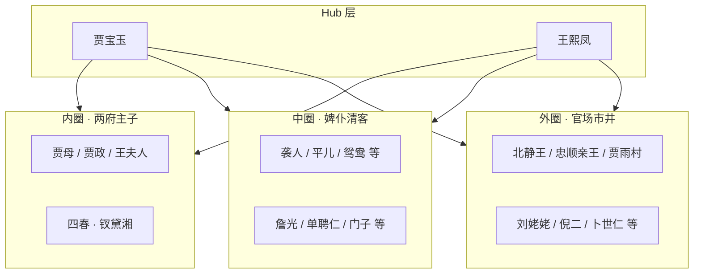

## 结论

《红楼梦》被誉为古典小说的「人物博物馆」。红学界因**统计标准不同**（是否含无名丫鬟、仅提及者、神话层等），形成几组经典数据：

| 口径 | 人数 | 来源 / 边界 |
|------|------|-------------|
| **732 人** | 447 有名有姓 + 212 半名 + 73 仅提及 | 徐恭时《红楼梦寻源》，最广泛引用 |
| **975 人** | 凡索引出现者皆计 | 中国艺术研究院红楼梦研究所校注本人名索引（1980s） |
| **~100 人** | 有独立台词、推动情节的活跃节点 | 叙事学 / 图论常用「核心子网」估计 |
| **209 页** | 本库独立 character 实体 | 见 [人物名录](人物名录.md)；图 **219 节点 / 683 边** |

**本库定位**：优先维护 L1「情节可溯源实体页」，不追求 975 全索引粒度；若要逼近 732/975，需另建 roster 分级（`named` / `partial` / `mentioned_only`），与现有 wiki 页并存。

**圈层 Hub**：虽潜在节点近千，**中介中心度**最高者仍是 [[贾宝玉]]、[[王熙凤]]——分别连接姊妹诗社、怡红院小厮与官场王府、管家婆子与放账借贷等多圈。

## 论据（带出处）

### 1. 732 人：徐恭时三分法

清代红学家徐恭时在《红楼梦寻源》中地毯式清点，总人数 **732**：

- **447**：有名有姓
- **212**：有姓无名，或有名无姓
- **73**：提及但未出场（如 [[林如海]] 祖上、远房亲戚名号）

此口径把「可在索引中定位的称谓」都算作节点，但区分完整度。

### 2. 975 人：红研所「凡见皆计」

红研所二十世纪八十年代校注本编纂人名索引时，将**丫鬟、小厮、顺口提及的亲戚、管戏班婆子、太医**等全部纳入，得 **975 人**。这是目前文献中**最庞大**的单书人物总数统计，适合作为「全书潜在节点上界」。

### 3. ~100 人：情节驱动子网

大众熟知的 **金陵十二钗** 正、副、又副册，加上主要贾府男丁（[[贾政]]、[[贾珍]]、[[贾琏]] 等）、核心管家（[[赖大]]、[[林之孝]]、[[周瑞家的]]）与重要外客（[[北静王]]、[[刘姥姥]]），构成约 **100 个活跃节点**。本库 **209 实体页**略宽于该数，因含楔子神话层（[[神瑛侍者]]、[[警幻仙子]] 等）、四王八公余员、家塾学童与一批有出处情节的配角。

### 4. 圈层结构（社会子图）

| 圈层 | 典型成员 | 叙事功能 |
|------|----------|----------|
| **内圈** | 贾母、贾政、十二钗、薛家 | 家族伦理、诗社、省亲、婚嫁 |
| **中圈** | 大丫鬟、管家、清客、小厮 | 日常运转、信息传递、帮闲借贷 |
| **外圈** | 郡王、太监、僧道、市井 | 政治压力、命运隐喻、世情对照 |
| **楔子层** | 甄士隐、神瑛/绛珠、警幻 | 神话框架，与人间子网弱连接 |

### 5. 图论视角

- **节点规模**：潜在社会网络 **900+**（按 975 上界）；本库关系图 **219 节点** 为已建模、有 `relations` 边的子集。
- **Hub 与桥接**：[[贾宝玉]] 连怡红院、诗社、琪官、蒋玉菡；[[王熙凤]] 连管家、放账、官场、抄检——二者 **betweenness** 最高，删去则子图分裂。
- **权重**：本库 `weight` 按出场与关系数重算（见 `/dream`），影响 [bestiary](/honglou/bestiary) 与 [graph](/honglou/graph) 节点大小。

### 6. 本库与红学口径映射

| 红学层级 | 本库对应 | 路径 |
|----------|----------|------|
| 975 潜在节点 | 未全建页 | 可扩展 `honglou.character_roster.json` |
| ~100 活跃节点 | bestiary 8 组 ≈ 209 人 | [人物名录](人物名录.md) |
| 447 有名有姓 | 209 页 + 待 ingest 长尾 | `characters/红楼梦/*.md` |
| 关系子网 | 683 边 | `src/data/红楼梦.relations.json` |

## 相关链接

- [人物名录](人物名录.md) — 209 实体页索引
- [/honglou/bestiary](/honglou/bestiary) — 图鉴分组（金陵十二钗、尊长、宁国府等 8 组）
- [/honglou/graph](/honglou/graph) — 关系图谱
- [建筑规模与空间结构](建筑规模与空间结构.md) — 建筑侧对照（107 处 location）
- [[贾宝玉]] · [[王熙凤]] · [[贾母]] · 第2回（冷子兴演说人口）· 第5回（警幻册）
