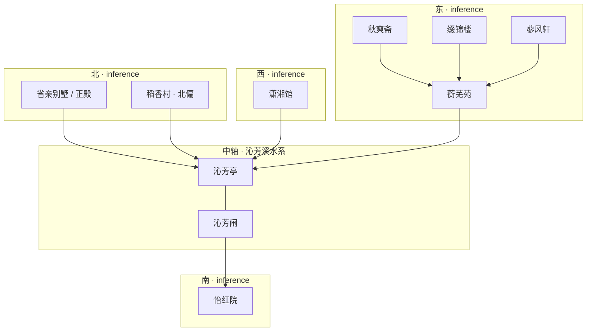

## 结论

**fact 层**：第17回可确证的是**叙事游线**（进门障山 → 曲径 → 沁芳亭 → 潇湘馆 → 稻香村 → 蓼汀花溆 → 蘅芜苑 → 正殿 → 沁芳闸 → 怡红院 → 出园），以及若干**定性间数**（如正门五间、潇湘馆「一明两暗」、蘅芜苑「五间清厦」）。正文**未给出**全园总尺度与各院间距。

**inference 层**：红学「南北中轴说」（周汝昌等）以沁芳溪为纲、北正殿南怡红、东西分馆，可辅助读第23回分房，但**不能**与第17回游线逐步等同，亦不能推出测绘坐标。

## 一、fact：第17回叙事游线

依据：程高本 [`chapters/红楼梦/017.md`](../../chapters/红楼梦/017.md)（「大观园试才题对额」）。

> 贾政命「从此小径游去，回来由那一边出去，方可遍览」；至正殿时自述「才游了十之五六」，后因雨村回话「不能细观」，改由闸侧一路至怡红院后出园。

| 序 | 节点 | 正文动作 / 题额 | 本库实体 |
|----|------|-----------------|----------|
| 0 | 园门 | 先关门外看，再开门；**正门五间** | [[大观园]] |
| 1 | 翠嶂 | 障景；「非此一山，则诸景悉入目」 | （障山，未单列页） |
| 2 | 山口 | 镜面白石留题 → **曲径通幽** | [[曲径通幽]] |
| 3 | 石洞 → 池 | 再进数步渐向北；飞楼、清溪、**石桥三港**，**桥上有亭** → **沁芳** | [[沁芳亭]] |
| 4 | 潇湘馆 | 粉垣内翠竹；题 **有凤来仪** | [[潇湘馆]] |
| 5 | 稻香村 | 黄泥矮墙、杏花；题 **杏帘在望** / 正名稻香村 | [[稻香村]] |
| 6 | 花径 | 荼蘼架 → 木香棚 → 牡丹亭 → 芍药圃 → 蔷薇院 → 芭蕉坞 | （路径景观） |
| 7 | 蓼汀花溆 | 水声、石洞、港；宝玉拟 **蓼汀花溆**（贾政批） | [[蓼溆]] |
| 8 | 蘅芜苑 | 清凉瓦舍、异草；**五间清厦** → **蘅芷清芬** | [[蘅芜苑]] |
| 9 | 省亲正殿 | 崇阁、玉石牌坊；拟「蓬莱仙境」未用；**游十之五六** | [[省亲别墅]] |
| 10 | 沁芳闸 | 大桥，水如晶帘，**通外河之闸** → **沁芳闸** | [[沁芳闸]] |
| 11 | 怡红院 | 蕉棠并植；题 **红香绿玉**（后元春改怡红快绿，第18回）；**未进两层便迷** | [[怡红院]] |
| 12 | 出园 | 由山脚转平坦大路至园门前 | [[大观园]] |

**本回未细游、第23回才分派的居所**（无第17回间数摘录）：[[秋爽斋]]、[[缀锦楼]]、[[蓼风轩]]（及 [[栊翠庵]] 等）。

### 水系 fact（同回交代）

贾珍指沁芳水：「从闸起流至洞口，从**东北山坳**引至村庄，又开岔口引到**西南**，共总流到此处，仍合一处，从墙下出去。」（第17回）——可考**流向关系**，非定量距离。

---

## 二、fact：正文间数 / 格局摘录表

仅列第17回**明确出现**的间数、层数、格局用语；「数楹」「几间」等模糊表述照录，不换算为现代尺寸。

| 节点 | 间数 / 尺度用语 | 格局 / 其他可考描写 | 出处 |
|------|-----------------|---------------------|------|
| 园正门 | **五间** | 桶瓦泥鳅脊，水磨群墙，白石台矶 | 第17回 |
| 曲径通幽 | — | 非主山，「探景一进步」；山口镜面白石 | 第17回 |
| 池桥亭区 | **石桥三港**；**桥上有亭** | 再进数步「渐向北边」；飞楼插空 | 第17回 |
| 潇湘馆 | **小小两三间**，**一明两暗** | 曲折游廊；后院有**两间小小退步**；引泉开沟「仅尺许」 | 第17回 |
| 稻香村 | **数楹**茅屋 | 黄泥矮墙；纸窗木榻 | 第17回 |
| 蓼汀花溆 | — | 采莲船四只、座船一只「尚未造成」 | 第17回 |
| 蘅芜苑 | **五间清厦**连着卷棚 | 四面出廊；超手游廊 | 第17回 |
| 省亲别墅 | — | 崇阁巍峨，**层楼高起**；玉石牌坊 | 第17回 |
| 沁芳闸 | — | 大桥，引外河，水如晶帘 | 第17回 |
| 怡红院 | **几间**房内 | **四面**雕空玲珑木板；「**未进两层**，便都迷了旧路」 | 第17回 |
| 陈设（非建筑） | 量准尺寸 | 贾琏：各处图样「**量准尺寸**」办帐幔帘幔 | 第17回 |

**正文未写**：全园周长、面积、院与院之间步数/丈尺、秋爽斋/缀锦楼/蓼风轩间数。

---

## 三、inference：南北中轴说与七院方位

> 以下属**学者推断**，见 `src/data/红楼梦.garden-scholarship.json` 之 `orientation_theories`；与第17回**叙事顺序**不必一致。

### 3.1 南北中轴说（周汝昌等）

| 要点 | 内容 |
|------|------|
| 主张 | 以 **沁芳溪** 为水系中轴 |
| 北 | [[省亲别墅]] 正殿、仪典轴 |
| 南 | [[怡红院]] 方向 |
| 东 / 西 | 诸馆分列（见下表） |
| 局限 | 纯文学综合园林，无正文经纬度；各家平面图互异 |

### 3.2 七处主居所相对方位（inference）

分房依据 **第23回**；方位取自本库 `garden-scholarship.json` 之 `direction_hint`，**非曹氏定稿地图**。

| 居所 | 居住者 | 相对方位（inference） | 第17回是否细游 |
|------|--------|----------------------|-----------------|
| [[潇湘馆]] | 林黛玉 | 西 | ✅ 有间数 |
| [[蘅芜苑]] | 薛宝钗 | 东 | ✅ 五间清厦 |
| [[怡红院]] | 贾宝玉 | 南 | ✅ 两层迷径 |
| [[稻香村]] | 李纨 | 北偏 | ✅ 数楹茅屋 |
| [[秋爽斋]] | 贾探春 | 东 | ❌ 第23回 |
| [[缀锦楼]] | 贾迎春 | 东 | ❌ 第23回 |
| [[蓼风轩]] | 贾惜春 | 东 | ❌ 第23回 |

### 3.3 方位示意（mermaid，inference）

读图注意：

- **实线关系**示意的仅为「相对区块」，**不是**第17回实际步行顺序（该顺序见上文第一节表格）。
- 东 trio（秋爽斋、缀锦楼、蓼风轩）在第17回游线中**未出现**，方位完全依赖 inference。

---

## 四、与第17回游线的关系

| 维度 | fact（第17回） | inference（中轴说） |
|------|----------------|---------------------|
| 顺序 | 潇湘 → 稻香 → 蓼溆 → 蘅芜 → 正殿 → 闸 → 怡红 | 不以叙事序等于南北 |
| 尺度 | 见第二节摘录表 | 无定量 |
| 用途 | 题对额、障景、对比造境 | 辅助理解第23回分房 |

---

## 五、与 location 页 `features` 的对应

各节点 `features` 已写入 **「第17回：…」** 间数摘录（脚本 `scripts/patch_hlm_building_data.py` 可复跑）。两府间数见 [宁荣两府中轴与间数摘录](宁荣两府中轴与间数摘录.md)。

---

## 相关链接

- 原文：[第17回](../../chapters/红楼梦/017.md)（程高本）
- 分房：[大观园建筑名录](大观园建筑名录.md)（第23回）
- 两府：[宁荣两府中轴与间数摘录](宁荣两府中轴与间数摘录.md)
- 总论：[大观园方位与复原考证](大观园方位与复原考证.md) · [建筑规模与空间结构](建筑规模与空间结构.md)
- 数据：`src/data/红楼梦.garden-scholarship.json`
- 实体：[[大观园]] · [[潇湘馆]] · [[怡红院]] · [[蘅芜苑]] · [[稻香村]]
