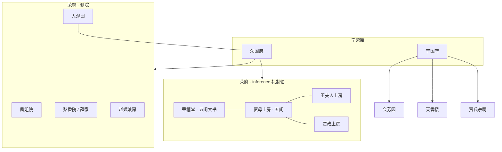

## 结论

**fact 层**：两府建筑数据以**礼仪中轴 + 上房间数 + 门禁层级**为主，散见第3、5、11、53、55回等；**无全府平面图与定量间距**。大观园游线与间数见专页 [大观园游线与间数摘录](大观园游线与间数摘录.md)。

**inference 层**：荣府可粗分为「正院礼制轴」（荣禧堂—贾母上房—贾政/王夫人上房）与「角院/侧院」（梨香院、凤姐院、赵姨娘房等），宁府以会芳园—天香楼—宗祠为丧祭与宴游轴；**不能**推出精确测绘坐标。

---

## 一、fact：荣国府间数与节点

| 节点 | 间数 / 格局用语 | 出处 | 本库 |
|------|-----------------|------|------|
| 荣禧堂 | **五间大书**，屏开鸾凤 | 第3回黛玉入府 | [[荣禧堂]] |
| 贾母上房 | **五间上房** | 第3回 | [[贾母上房]] |
| 荣国府（总） | 角门、倒厅、穿堂、上房、花厅 | 第3、6回 | [[荣国府]] |
| 梨香院 | 东院角院，薛家**寄居** | 第4、7、23回 | [[梨香院]] |
| 议事厅 | 园门南**三间**小花厅，匾**辅仁谕德** | 第55回 | [[议事厅]] |

**门禁 fact**（层级由外入内）：[[门上]] → [[二门]] → [[仪门]]（第53回主仆分界）→ [[穿堂]] → 各上房/角院；入大观园经 [[角门]]、[[夹道]]（见第23回及后文）。

---

## 二、fact：宁国府间数与节点

| 节点 | 要点 | 出处 | 本库 |
|------|------|------|------|
| 宁国府 | 与荣府连街，贾珍、尤氏主内 | 第2回起 | [[宁国府]] |
| 会芳园 | 宁府**花园**，贾母赏花 | 第5回 | [[会芳园]] |
| 天香楼 | 宁府内**楼**，可卿丧宴 | 第11、13回 | [[天香楼]] |
| 贾氏宗祠 | **开宗祠**，悬供、祭祀大典 | 第53回 | [[贾氏宗祠]] |

---

## 三、fact：都外与皇宫（非两府，常并提）

| 节点 | 要点 | 出处 |
|------|------|------|
| [[临敬殿]] | 皇宫陛见；元春封妃 | 第16回 |
| 各王府 | 北静、南安、忠顺等；寿宴、索人 | 第14、33、71回 |

---

## 四、inference：荣府相对布局示意

> 非正文坐标；仅供对照「谁与谁同在一进 / 同在一街」。

---

## 五、与 location 页 `features` 的对应

本库已在各 `locations/红楼梦/*.md` 的 `features` 中追加 **「第N回：…」** 间数/格局摘录（可脚本复跑 `scripts/patch_hlm_building_data.py`）。检索示例：

- 含 `第17回` → 大观园游线节点（十处）
- 含 `第3回` → 荣府礼制轴
- 含 `第55回` → 议事厅三间

---

## 相关链接

- [大观园游线与间数摘录](大观园游线与间数摘录.md)
- [大观园方位与复原考证](大观园方位与复原考证.md)
- [建筑规模与空间结构](建筑规模与空间结构.md)
- [大观园建筑名录](大观园建筑名录.md)
- 原文：第3回 · 第53回 · 第55回
- 数据：`src/data/红楼梦.locations.json`
