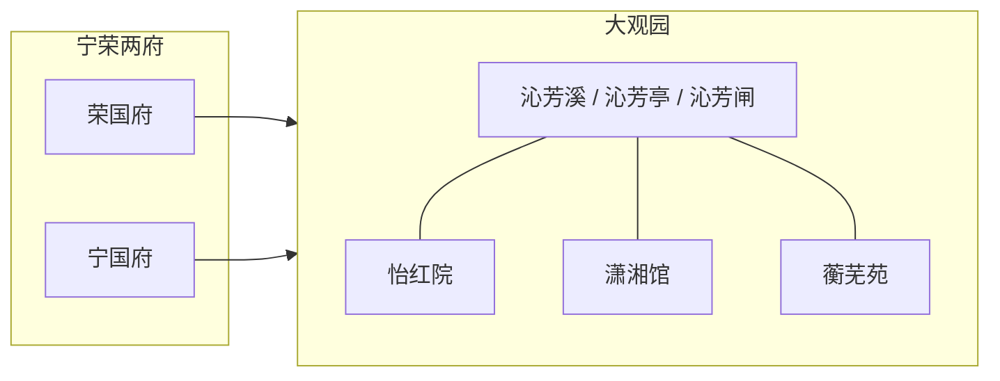

## 结论

《红楼梦》中的建筑与景观是**人物命运的容器**；学界通常统计全书有名有姓或可指认的空间节点约 **100–110 处**，其中：

| 区块 | 约数 | 要点 |
|------|------|------|
| **宁荣两府** | ~60 | 荣禧堂、贾母正房、梨香院、宗祠、天香楼等权力与生活轴 |
| **大观园** | ~40–45 | 第17回试才题对额系统性「点亮」；七处主居所 + 亭榭堂馆 |
| **外部** | 若干 | 清虚观、铁槛寺、王府、葫芦庙等 |

**本库**：**107** 处 `location` 实体（见 [大观园建筑名录](大观园建筑名录.md)），数量级与红学 **100+** 口径一致。统计边界为「有独立页、可链回目」的空间节点，不含纯过道一笔带过且未单列者。

**空间拓扑**：园中以 **沁芳溪** 水系与游廊串联；人物与院落**强绑定**（如 [[林黛玉]]↔[[潇湘馆]]），抄检、锁门等空间失效直接预示绑定其上的命运。

## 论据（带出处）

### 1. 学界「100+ 处」从何而来

建筑研究通常把下列皆计为节点：

- **命名建筑**：馆、院、庵、楼、亭、阁
- **功能空间**：宗祠、家塾、议事厅、上房套间
- **景观与界标**：牌楼、桥梁、闸、假山、山口

不把「某夹道走过」 unless 反复出现或有情节锚点。因此 **100–110** 与 **107 页** 同属「可指认空间」粒度，而非测绘意义上的每一个房间。

### 2. 宁荣两府大框架（约 60 处）

两府是省亲前的主舞台，权力与生活中心包括：

| 类别 | 代表节点（本库） | 出处 / 功能 |
|------|------------------|-------------|
| 荣府中轴 | [[荣庆堂]]、[[贾母上房]]、[[贾政上房]]、[[王夫人上房]] | 第3回起；正礼与日常 |
| 荣府侧院 | [[梨香院]]（薛家早期）、[[凤姐院]]、[[赵姨娘房]] | 第4回、管家线 |
| 宁府中轴 | [[贾氏宗祠]]、[[天香楼]]、[[尤氏上房]] | 第13回丧仪、可卿线 |
| 连接与门禁 | [[宁荣街]]、[[二门]]、[[仪门]]、[[角门]] | 空间层级、出入礼仪 |

第13回可卿大丧，**镇国公**等王公路祭，说明两府建筑网络与外部礼仪空间相连（见 [[镇国公]] 人物页）。

### 3. 大观园（约 40–45 处）

第 **17 回**「大观园试才题对额」中，[[贾宝玉]] 随 [[贾政]] 游园，是对园内部节点的**系统性初始化**；第 **23 回**分派七处居所。

**群芳主居所（高权重）**：

| 建筑 | 居住者 | 隐喻要点 |
|------|--------|----------|
| [[怡红院]] | [[贾宝玉]] | 全园枢纽，「怡红快绿」 |
| [[潇湘馆]] | [[林黛玉]] | 竹、孤高、泪 |
| [[蘅芜苑]] | [[薛宝钗]] | 冷香、雪洞、世故 |
| [[稻香村]] | [[李纨]] | 田园、守节 |
| [[秋爽斋]] | [[贾探春]] | 阔朗、理家 |
| [[缀锦楼]] | [[贾迎春]] | 紫菱洲、软弱 |
| [[蓼风轩]] | [[贾惜春]] | 近水、出家之兆 |
| [[栊翠庵]] | [[妙玉]] | 园中唯一宗教节点 |

**公共与景观节点**（部分）：[[省亲别墅]]、[[沁芳亭]]、[[沁芳闸]]、[[凸碧山庄]]、[[凹晶溪馆]]、[[暖香坞]]、[[芦雪庵]]、[[红香圃]]、[[缀锦阁]]、[[稻香村]] 等——详见 [大观园建筑名录](大观园建筑名录.md)。

### 4. 外部与过渡空间

| 建筑 | 要点 | 首现 |
|------|------|------|
| [[清虚观]] | 打醮、张道士说亲 | 第29回 |
| [[铁槛寺]] | 可卿停灵、凤姐弄权 | 第15回 |
| [[水月庵]] | 馒头庵、司棋、智能 | 第71回 |
| [[葫芦庙]] | 楔子、雨村、门子旧身 | 第1回 |
| [[北静王府]] 等 | 王府轴，不在园内 | 第14回 |

### 5. 空间拓扑（图论视角）

- **节点**：107 个 location ≈ 红学 100+ 空间节点。
- **边**：游廊、夹道、桥、门——正文常写「出角门」「过蜂腰桥」，构成**可通行图**；本库 `locations` 与回目 `locations` frontmatter 可逐步补全邻接。
- **人物—建筑绑定**：黛玉活动范围高度集中于潇湘馆（第27回葬花等）；宝玉以怡红院为 hub；抄检大观园（第74回）是对**空间网络**的暴力遍历，对应人物节点同时被审查。

### 6. 本库与红学口径映射

| 红学口径 | 本库 | 说明 |
|----------|------|------|
| 100–110 处 | **107** location 页 | [大观园建筑名录](大观园建筑名录.md) |
| 大观园 ~40–45 | 名录中园内部条 + 七居所 | 第17、23回 |
| 两府 ~60 | 荣/宁府及上房、门禁子节点 | 分散于 `locations/红楼梦/` |
| 空间数据 | `src/data/红楼梦.locations.json` | 生成产物，勿手改 |

## 相关链接

- [大观园建筑名录](大观园建筑名录.md) — 107 处索引与匾额表
- [大观园游线与间数摘录](大观园游线与间数摘录.md) — 第17回 fact 游线与间数表
- [宁荣两府中轴与间数摘录](宁荣两府中轴与间数摘录.md) — 两府 fact 间数与中轴示意
- [大观园方位与复原考证](大观园方位与复原考证.md) — 方位与复原讨论
- [人物规模与圈层结构](人物规模与圈层结构.md) — 人物侧 732 / 975 / 209 对照
- [/honglou/places](/honglou/places) — 地点浏览（若 features 含 `places`）
- [[大观园]] · [[怡红院]] · [[潇湘馆]] · 第17回 · 第74回
