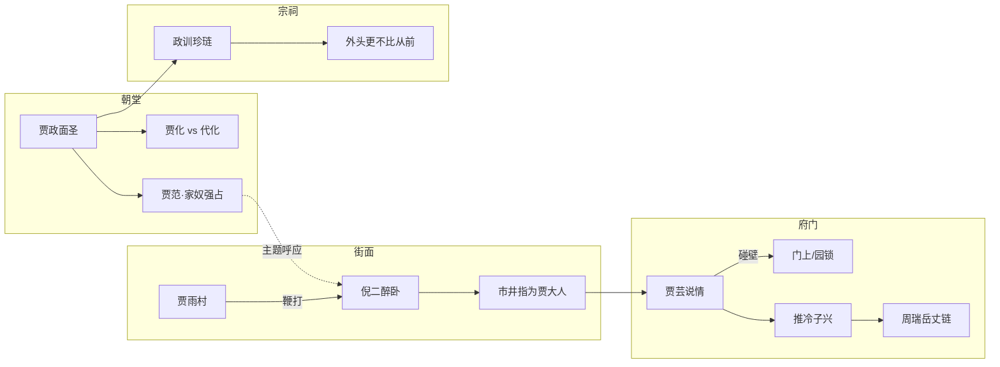

## 结论

**枉法害民纵切** 串联贾府体系内 **主动枉法** 与 **名义连坐反噬** 两条线：

**前半（4–48）** — [[贾雨村]] 与权门 **一贯** 徇情枉法：**第4回** [[门子]] 示 [[护官符]]，[[冯渊]] 案了；**第16回** [[王熙凤]] 贿 [[云光]]（[[守备]]），[[张金哥]] 自缢；**第21回** [[多官]]（多浑虫）线写琏偷情、凤姐审平儿（程高本，非薛蟠人命）；**第48回** 雨村夺 [[石呆子]] 古扇献 [[贾赦]]。

**后半（101–104）** — **抄报连坐** + **ch104 四线并置**：
- **第101回** [[贾琏]] 阅邸抄：[[鲍音]]（贾化家人）、[[时福]]（贾范家人），「心中不自在」；
- **第104回** [[贾政]] **面圣** 分奏贾化/代化、应答贾范与「家奴强占良民妻女」；
- **同回** [[贾雨村]] **鞭打** [[倪二]]，市井却指为「贾大人」、荣府一家——**枉法者仍姓贾，受害侠者亦在贾门阴影下**；
- **同回** [[贾芸]] 应倪家说情 **碰壁**（门上、园锁、推 [[冷子兴]]），反悟「人命官司不知有多少」——与 ch24 倪二义借 **对倒**；
- **同回** 祭祖后 [[贾政]] **祠旁训** [[贾珍]]、[[贾琏]]：「外头家事更不比从前」。

与 [[市井侠义伏线链]] 对照：**法—权—侠—吝** 四层在败象中 **倒置**（侠者受刑、府门紧闭、权者仍网罗）。

## 论据（带出处）

### 前四十二回：主动枉法

| 案件 | 回目 | 受害 / 关键 | 要点 |
|------|------|-------------|------|
| 葫芦案 | 第4回 | 冯渊、英莲 | [[护官符]]，门子献策 |
| 张金哥 | 第16回 | 金哥、守备 | 凤姐三千两 |
| 多官 | 第21回 | 多浑虫 | 贾琏偷情，凤姐审平儿 |
| 古扇 | 第48回 | 石呆子 | 雨村讹诈下狱 |
| 义借对照 | 第24回 | 贾芸、倪二 | 醉金刚不取利借银，助芸谋差 |

### 后四十回：抄报连坐（101）

| 案件 | 回目 | 奏本 / 人物 | 要点 |
|------|------|-------------|------|
| 神枪出边 | 第101回 | 王忠奏、[[鲍音]] | 「头一名鲍音，口称系太师镇国公贾化家人」 |
| 家奴害命 | 第101回 | 李孝奏、[[时福]] | 「凶犯姓时名福，自称系世袭三等职衔贾范家人」 |

**ch101 叙事**（贾琏视角）：五更欲往裘世安家，见桌上昨日抄报——两案皆挂 **「贾」** 姓供词，不及细读第三件即出门；同回 **王仁**「忘仁」、海疆亏空并置，强化「姓贾不祥」。

### 第104回：四线并置

#### 一、面圣：奏本落地（贾政）

- 海疆旨意先传：「贾存周江西粮道被参回来」（ch104 开头），与 ch101 海疆、抄报 **同调**。
- 面圣问 **云南私带神枪**：本上 **原任太师贾化** 家人；贾政急奏先祖名 **代化**，主上还引「前放兵部后降府尹的 **贾化**」——同名异人，须 **分奏** 才脱钩（chapters/红楼梦/104）。
- 主上再问：**苏州刺史奏的贾范，是你一家子么？** 变色道：「纵使 **家奴强占良民妻女**，还成事么？」贾政只敢奏 **远族**——与 ch101 [[时福]] 供词 **同题**，由 **邸抄** 升为 **御前追问**。
- 贾政归府叹：「究竟主上记着一个 **贾** 字就不好」；众人劝「假是假」，政仍言 **两个世袭无可奈何**（ch104）。

#### 二、街面：雨村鞭倪二（法权倒置）

- 雨村复旨回都，轿前 **倪二** 醉卧街心、口称「便是大人老爷也管不得」；雨村怒 **鞭打**，带入衙门（ch104）。
- 看热闹者传：**那贾大人是荣府的一家**——行刑者是 **雨村**，声名却 **挂在贾姓** 上。
- 倪二出狱后（只打几板）威胁：要叫朋友吵嚷贾家 **倚势欺人、盘剥小民、强娶有男妇女**——口头指控与 ch101 **时福案**（家奴倚势、害命） **字面同型**，尚未成奏本，已在 **街坊舆论** 发酵（ch104）。

#### 三、府门：芸说情碰壁（恩义断裂）

- 倪女依市井之言，与母找 **贾芸**：「你父亲与二爷相好，求说情。」贾芸 **一口应承**：「那贾大人全仗 **我家的西府** 才做了这么大官」（ch104）。
- **实际碰壁**：凤姐送礼不收后 **久不进荣府**；门上只回「二爷不在家」；绕后园 **门锁**；推 **[[冷子兴]]**（[[周瑞]] 亲戚），倪家冷笑而去（ch104）。
- 贾芸独悟：「 **人命官司不知有多少呢** 」——ch24 受倪二 **义借** 谋差，ch104 **不能** 为倪二 **说情**；护官符时代的 **单向恩义** 在败局里 **断裂**。

#### 四、宗祠：政训珍琏（内诫）

- 次日祭祖后，[[贾政]] 于 **祠旁厢房** 叫 [[贾珍]]、[[贾琏]]：「听见外头说起你家里 **更不比从前**，诸事要谨慎」；「琏儿也该听着」——珍琏 **脸涨通红**，只答「是」（ch104）。
- 与 ch101 抄报、ch104 面圣 **同调**：外有奏本、内有父训，**法—家—族** 三层同时收紧。

**四线合读**：ch101 抄报把 **「贾家奴」** 写入公文；ch104 贾政 **御前分族**、倪二 **街骂同题**、贾芸 **闭门**、祠旁 **训珍琏**——**朝—街—府—祠** 同时收紧，枉法纵切由 **个案** 升为 **系统压力**。

**名讳分读**：抄报 **贾化** ≠ 宁荣始祖 **代化**（贾政 ch104 亲口分奏）；**贾范** 供词为案犯自称，面圣亦作 **远族** 应对——与第4回护官符「护名籍网络」同型，方向由 **内护** 转为 **外参**。[[鲍音]]、[[时福]] 人物页仅 ch101 抄报同场，纵切在 **结构**，不在坐实当府某一主子。

## 图鉴 card 对照

| 人物 | 信物（card） | 要点 |
|------|-------------|------|
| [[门子]] | [[护官符]] | 第4回 |
| [[冯渊]] | — | 争买英莲 |
| [[张三]] · [[吴良]] | — | 薛蟠刑部案（第86回） |
| [[张华]] | — | 二姐前聘 |
| [[多官]] | [[荣国府]] | 酒肆人命 |
| [[石呆子]] | — | 古扇案 |
| [[鲍音]] | — | ch101 抄报·神枪案 |
| [[时福]] | — | ch101 抄报·家奴害命 |
| [[倪二]] | — | ch24 义借 ↔ ch104 鞭打 / 街骂 |
| [[贾芸]] | — | ch24 谋差 ↔ ch104 说情碰壁 |
| [[冷子兴]] | [[冷子兴演说]] | ch2 演说 ↔ ch104 芸推说情 |
| [[周瑞]] | — | ch104 芸推「周瑞亲戚冷子兴」 |
| [[卜世仁]] | — | 贾芸求赊对照 |

## 相关链接

- 主链：[[清客门客链]] · [[葫芦案]]（第4回）
- 后四十回：[[鲍音]] · [[时福]] · [[托孤末世链]]
- 对照：[[市井侠义伏线链]] · [[凤姐院管家链]] · [[邢房侍妾链]] · [[图鉴名物信物链总览]]
