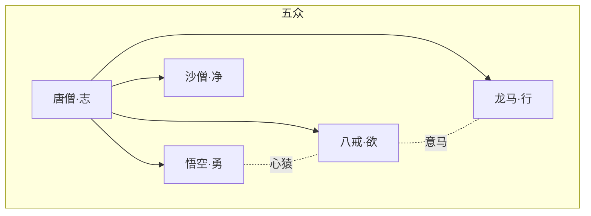

## 结论

取经队伍于 **第22回** 凑齐：唐僧 + 悟空 + 八戒 + 沙僧 + 白龙马。五众各对应修行一障，合则成「取经」之能。

| 成员 | 实体页 | 象征 | 入队回 |
|------|--------|------|--------|
| 唐僧 | [/xiyouji/c/唐僧](/xiyouji/c/唐僧) | 取经之志、凡心 | 第13回启程 |
| 孙悟空 | [/xiyouji/c/孙悟空](/xiyouji/c/孙悟空) | 心猿、神通 | 第14回 |
| 猪八戒 | [/xiyouji/c/猪八戒](/xiyouji/c/猪八戒) | 意马、欲望 | 第19回 |
| 沙僧 | [/xiyouji/c/沙僧](/xiyouji/c/沙僧) | 悟净、守戒 | 第22回 |
| 白龙马 | [/xiyouji/c/白龙马](/xiyouji/c/白龙马) | 脚力、忠诚 | 第15回 |

## 性格三角

- **悟空 vs 八戒**：「心猿意马」——一个闹，一个懒；紧箍与戒律皆针对此二。
- **沙僧**：少言挑担，调和师兄争执，象征「持重」。
- **龙马**：少台词，第30回「意马忆心猿」与八戒同念悟空。

## 前三十回时间线

| 回 | 事件 | 劫难 id |
|----|------|---------|
| 13–14 | 两界山收悟空 | xy-e-008 |
| 15 | 鹰愁涧化白马 | xy-e-010 |
| 16–17 | 观音院、黑风山 | xy-e-011 |
| 19 | 云栈洞收八戒 | xy-e-012 |
| 20–21 | 黄风岭 | xy-e-013 |
| 22 | 流沙河收沙僧 | xy-e-016 |
| 23 | 四圣试禅心 | xy-e-017 |
| 24–26 | 五庄观人参果 | xy-e-018 |
| 27 | 三打白骨精，贬悟空 | xy-e-020 |
| 30 | 宝象国前，意马忆心猿 | — |

## 内部矛盾（前三十回）

1. **信妖 vs 打妖**（第27回）：唐僧肉眼凡胎，悟空火眼金睛，师徒决裂。
2. **偷懒 vs 担当**：八戒巡山常谎报；沙僧默默挑担。
3. **戒 vs 欲**（第23回）：四圣试禅心，仅唐僧、沙僧守戒。

## 相关

- [观音菩萨与取经工程](观音菩萨与取经工程.md) · [人物名录](人物名录.md) · [八十一难总览](八十一难总览.md) · [/xiyouji/graph](/xiyouji/graph)
