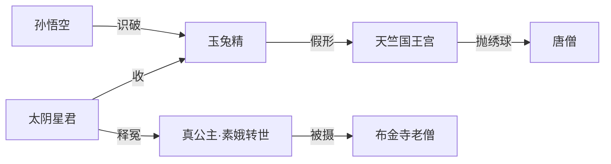

## 结论

天竺国线是 **灵山前最后一国**：假公主（玉兔）欲破唐僧元阳，真公主（素娥转世）囚于布金寺；[[太阴星君]] 下界收玉兔，冤债两清。

| 难号 | 回目 | 事件 |
|------|------|------|
| 78 | 93–95 | [xy-e-078](/xiyouji/nan/xy-e-078) 天竺招婚 |

## 双线结构

| 角色 | 身份 | 要点 |
|------|------|------|
| 玉兔精 | 广寒宫捣药玉兔 | [实体页](/xiyouji/c/玉兔精)；捣药杵斗金箍棒 |
| 真公主 | 月宫素娥转世 | 布金寺装风，老僧秘护 |
| 国王 | 怡宗皇帝 | [/xiyouji/c/天竺国国王](/xiyouji/c/天竺国国王) |

## 情节链

### 第93回 · 入国

- 给孤园问古：老僧言旧年风刮来「公主」，锁于敝房。
- 进城逢抛绣球招驸马；妖邪知唐僧将至，设彩楼采元阳。

### 第94–95回 · 招亲与识破

- 假公主绣球打中唐僧；[[内宫官]] 传旨排宴；悟空夜探，见玉兔本相。
- 天竺殿上斗法，玉兔使 **捣药杵**；[[太阴星君]] 带嫦娥下界收之。
- 释明：素娥曾打玉兔，玉兔报一掌之仇。

### 第96回 · 辨认真邪

- 国王审案，布金寺迎回真公主；关文加印，继续西行。

## 相关

- [天竺国](/xiyouji/l/天竺国) · [天竺国与玉兔之难](/xiyouji/topics/天竺国与玉兔之难) · 第93–96回 · [捣药杵](/xiyouji/i/捣药杵)
