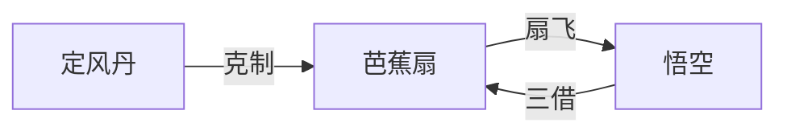

## 结论

当前 **10** 件法宝实体页，覆盖制造—持有—克制三链。完整索引见 [/xiyouji/items](/xiyouji/items)。

## 五众兵器

| 法宝 | 持有者 | 首现 | 页 |
|------|--------|------|-----|
| 金箍棒 | 孙悟空 | 第3回 | [/xiyouji/i/金箍棒](/xiyouji/i/金箍棒) |
| 九齿钉钯 | 猪八戒 | 第19回 | [/xiyouji/i/九齿钉钯](/xiyouji/i/九齿钉钯) |
| 降妖宝杖 | 沙僧 | 第22回 | [/xiyouji/i/降妖宝杖](/xiyouji/i/降妖宝杖) |
| 紧箍 | 唐僧/悟空 | 第14回 | [/xiyouji/i/紧箍](/xiyouji/i/紧箍) |

## 老君系宝贝

| 法宝 | 劫难场景 | 页 |
|------|----------|-----|
| 紫金红葫芦 | 平顶山莲花洞 | [/xiyouji/i/紫金红葫芦](/xiyouji/i/紫金红葫芦) |
| 幌金绳 | 平顶山莲花洞 | [/xiyouji/i/幌金绳](/xiyouji/i/幌金绳) |
| 金刚琢 | 金兜洞青牛精 | [/xiyouji/i/金刚琢](/xiyouji/i/金刚琢) |

## 火焰山双宝

- [芭蕉扇](/xiyouji/i/芭蕉扇) · [定风丹](/xiyouji/i/定风丹) · xy-e-048

## 后段法宝

| 法宝 | 场景 | 页 |
|------|------|-----|
| 人种袋 | 小雷音寺黄眉怪 | [/xiyouji/i/人种袋](/xiyouji/i/人种袋) |

## 待扩展

七星剑、羊脂玉瓶、金铙、捣药杵等；法宝↔event `artifacts[]` 全量对勘。
