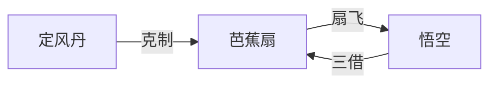

## 结论

当前 **22** 件法宝实体页，覆盖制造—持有—克制三链。完整索引见 [/xiyouji/items](/xiyouji/items)。

## 五众兵器

| 法宝 | 持有者 | 首现 | 页 |
|------|--------|------|-----|
| 金箍棒 | 孙悟空 | 第3回 | [/xiyouji/i/金箍棒](/xiyouji/i/金箍棒) |
| 九齿钉钯 | 猪八戒 | 第19回 | [/xiyouji/i/九齿钉钯](/xiyouji/i/九齿钉钯) |
| 降妖宝杖 | 沙僧 | 第22回 | [/xiyouji/i/降妖宝杖](/xiyouji/i/降妖宝杖) |
| 紧箍 | 唐僧/悟空 | 第14回 | [/xiyouji/i/紧箍](/xiyouji/i/紧箍) |
| 锦襴袈裟 | 唐僧 | 第16回 | [/xiyouji/i/锦襴袈裟](/xiyouji/i/锦襴袈裟) |

## 老君系宝贝

| 法宝 | 劫难场景 | 页 |
|------|----------|-----|
| 紫金红葫芦 | 平顶山莲花洞 | [/xiyouji/i/紫金红葫芦](/xiyouji/i/紫金红葫芦) |
| 幌金绳 | 平顶山莲花洞 | [/xiyouji/i/幌金绳](/xiyouji/i/幌金绳) |
| 金刚琢 | 金兜洞青牛精 | [/xiyouji/i/金刚琢](/xiyouji/i/金刚琢) |

## 火焰山双宝

- [芭蕉扇](/xiyouji/i/芭蕉扇) · [定风丹](/xiyouji/i/定风丹) · xy-e-048

## 后段法宝

| 法宝 | 场景 | 页 |
|------|------|-----|
| 人种袋 | 小雷音寺黄眉怪 | [/xiyouji/i/人种袋](/xiyouji/i/人种袋) |
| 金铙 | 小雷音寺 | [/xiyouji/i/金铙](/xiyouji/i/金铙) |
| 七星剑 | 平顶山莲花洞 | [/xiyouji/i/七星剑](/xiyouji/i/七星剑) |
| 羊脂玉净瓶 | 莲花洞 | [/xiyouji/i/羊脂玉净瓶](/xiyouji/i/羊脂玉净瓶) |
| 捣药杵 | 天竺玉兔 | [/xiyouji/i/捣药杵](/xiyouji/i/捣药杵) |
| 紫金铃 | 朱紫赛太岁 | [/xiyouji/i/紫金铃](/xiyouji/i/紫金铃) |
| 五彩仙衣 | 金圣宫娘娘 | [/xiyouji/i/五彩仙衣](/xiyouji/i/五彩仙衣) |
| 白布搭包 | 小雷音寺黄眉 | [/xiyouji/i/白布搭包](/xiyouji/i/白布搭包) |
| 阴阳二气瓶 | 狮驼大鹏 | [/xiyouji/i/阴阳二气瓶](/xiyouji/i/阴阳二气瓶) |
| 蟠龙拐 | 比丘白鹿 | [/xiyouji/i/蟠龙拐](/xiyouji/i/蟠龙拐) |
| 火尖枪 | 火云洞红孩儿 | [/xiyouji/i/火尖枪](/xiyouji/i/火尖枪) |
| 九瓣铜锤 | 通天河灵感大王 | [/xiyouji/i/九瓣铜锤](/xiyouji/i/九瓣铜锤) |

## 待扩展

绣花针等；法宝↔event `artifacts[]` 持续对勘。
