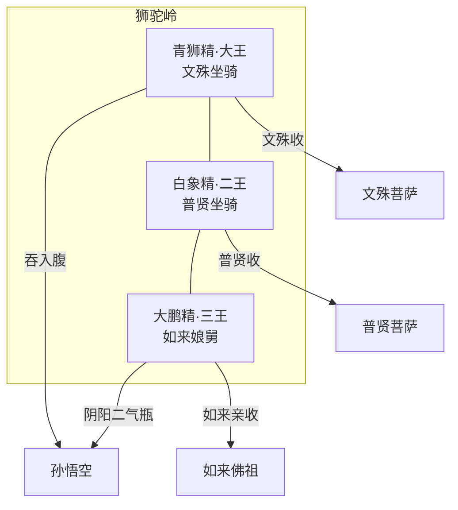

## 结论

狮驼岭是取经后段 **难度峰值** 之一：三魔分色（青/白/金），背景分属文殊、普贤、如来；四难连缀，终须如来亲降。

| 难号 | 回目 | 要点 | 事件 |
|------|------|------|------|
| 61 | 74–75 | 路阻狮驼 | [xy-e-061](/xiyouji/nan/xy-e-061) |
| 62 | 75–76 | 怪分三色 | [xy-e-062](/xiyouji/nan/xy-e-062) |
| 63 | 76 | 城里遇灾 | [xy-e-063](/xiyouji/nan/xy-e-063) |
| 64 | 77 | 请佛收魔 | [xy-e-064](/xiyouji/nan/xy-e-064) |

## 三魔谱系

| 妖王 | 实体页 | 靠山 | 收服 |
|------|--------|------|------|
| 青狮精 | [/xiyouji/c/青狮精](/xiyouji/c/青狮精) | 文殊菩萨 | 文殊 |
| 白象精 | [/xiyouji/c/白象精](/xiyouji/c/白象精) | 普贤菩萨 | 普贤 |
| 大鹏精 | [/xiyouji/c/大鹏精](/xiyouji/c/大鹏精) | 如来（孔雀之弟） | 如来 |

## 情节链（压缩）

### 第74–75回 · 入岭与斗法

- 巡山妖 [[小钻风]] 报「孙行者」之名，三魔知前仇（曾闻狮驼洞被棒）。
- 青狮 **吞悟空入腹**，悟空搅肠，魔降；后复战，悟空被阴阳二气瓶吸入。

### 第76回 · 狮驼城

- 四万七八千妖，城若鬼国；唐僧师徒暂脱后再被擒。
- 「唐僧已被夹生吃了」——悟空诈哭告如来（实为缓兵）。

### 第77回 · 请佛收魔

- 如来述 **孔雀大明王** 与大鹏同源；遣文殊、普贤收狮象。
- 大鹏不伏，如来以肉骗爪、指断筋；大鹏皈依，作护法。
- 唐僧实囚铁柜，未死。

## 评析

- **背景论**：三魔皆有佛庭根脚，属「有背景」难；读者常与前段无背景小妖对照。
- **叙事功能**：悟空首次因敌手过强而请如来；为灵山近境「佛收佛亲」预热。

## 相关

- 第74–77回 · [八十一难总览](/xiyouji/topics/八十一难总览) · `/xiyouji/bestiary`
