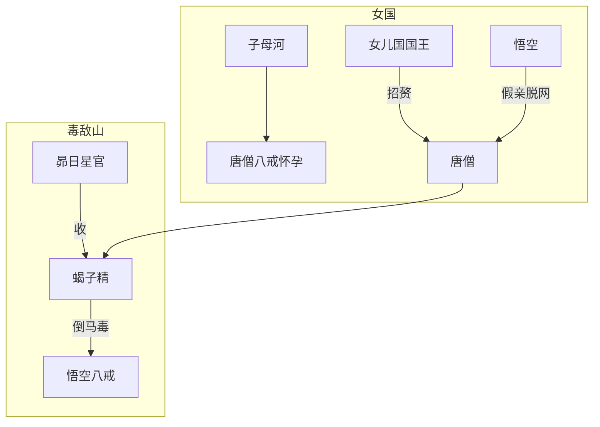

## 结论

西梁段是取经 **「色戒」与「毒劫」** 双连：女王以人伦留唐僧（42难），蝎子精以倒马毒伤三徒（43难）。地点相连，叙事上先柔后烈。

| 难号 | 回目 | 事件 |
|------|------|------|
| 42 | 53–54 | [xy-e-042](/xiyouji/nan/xy-e-042) 西梁国留婚 |
| 43 | 55–56 | [xy-e-043](/xiyouji/nan/xy-e-043) 琵琶洞受苦 |

## 双线结构

## 西梁女国（第53–54回）

| 要点 | 说明 |
|------|------|
| 子母河 | 唐僧、八戒误饮，迎阳馆取落胎泉 |
| 女王 | [/xiyouji/c/女儿国国王](/xiyouji/c/女儿国国王)，举国无男，太师作媒 |
| 脱困 | 悟空定计：假从婚事，换通关文牒后驾云脱身 |

## 琵琶洞（第55–56回）

| 要点 | 说明 |
|------|------|
| 蝎子精 | [/xiyouji/c/蝎子精](/xiyouji/c/蝎子精)，毒敌山琵琶洞 |
| 倒马毒 | 尾钩曾伤如来；观音举 **昴日星官**（本相大公鸡）收伏 |
| 情节 | 女妖诱唐僧成亲，悟空八戒入洞相救皆被扎伤 |

## 评析

- 女王之难重在 **唐僧心志** 与「假亲」喜剧；蝎子精之难重在 **观音调度** 与五行相克（鸡克虫）。
- 与后段「假公主招亲」（天竺玉兔）形成 **招亲母题** 的呼应。

## 相关

- [西梁女国](/xiyouji/l/西梁女国) · 第53–56回
