## 结论

词话本金瓶梅的空间叙事以 **清河县城 ↔ 西门府七进深宅** 为双核：府内分 **前厅**（[[大厅]] / [[大门首]] / [[灵堂]] / [[前厅书房]]）→ **后宅**（[[仪门]]、[[上房]]、[[穿廊]]、[[后楼]] + 五房院落）→ **后园**（[[花园]] / [[木香棚]] / [[翡翠轩]] / [[藏春坞]] / [[卷棚]]，[[角门]] 通厅园）→ **灶区**（[[厨房]] 邻 [[孙雪娥房]]）→ **侧厢**（[[厢房]]）；府外以 [[清河县]] 为总括，[[县衙]]、[[提刑千户所]]、[[守备府]]、[[何千户家]]、[[招宣府]] 锚定官场，[[县前街]] / [[西门庆生药铺]] / [[铺子里]] / [[门房]] / [[对门楼]] 构成经济外环，[[紫石街]] / [[王婆茶坊]] / [[潘家]] 为「色」线发端，[[狮子街]] 勾栏群（[[李娇儿院]]、[[丽春院]]、[[郑爱月儿院]]、[[王六儿家]]）并置，[[应伯爵家]] 为帮闲据点。[[玉皇庙]] / [[吴道官道院]]、[[永福寺]]、[[观音庵]] / [[莲花庵]]、[[报恩寺]] / [[报国寺]]、[[五岳观]] 为佛道节点，[[临清钞关]]、[[皇庄]]、[[怀庆府]]、[[东京]] 为政商链外环，[[城西河边]] 锚定苗天秀刑名线。知识库现 **71** 处 `locations/金瓶梅/` 实体，按 `map_zone` 分为 **府内 23**、**市井 30**、**寺观 8**、**城外 10**。

## 空间总览（府内 + 清河）

```mermaid
flowchart TB
  subgraph 城外["map_zone: 城外"]
    东京["东京"]
    钞关["临清钞关"]
    内相园["内相花园"]
    翟宅["翟亲家宅"]
    东昌["东昌府"]
    河口["新河口"]
    阳谷["阳谷县"]
    皇庄["皇庄"]
    怀庆["怀庆府"]
    河西["城西河边"]
  end
  subgraph 清河["清河县 · 市井"]
    清河县["清河县"]
    县衙["县衙"]
    提刑所["提刑千户所"]
    帅府["守备府"]
    乔家["乔大户家"]
    何府["何千户家"]
    招宣["招宣府"]
    张宅["张亲家宅"]
    崔宅["崔中书家"]
    县前街["县前街"]
    狮子街["狮子街"]
    药铺["西门庆生药铺"]
    铺子["铺子里"]
    门房["门房"]
    对门楼["对门楼"]
    绒线["绒线铺"]
    紫石街["紫石街"]
    潘家["潘家"]
    茶坊["王婆茶坊"]
    花家["花子虚宅"]
    李院["李娇儿院"]
    丽春["丽春院"]
    郑院["郑爱月儿院"]
    王六["王六儿家"]
    王皇["王皇亲宅"]
    韩姨["韩姨夫家"]
    石桥["石桥儿巷"]
    王家["王家巷"]
    应宅["应伯爵家"]
    大街皇["大街皇亲家"]
  end
  subgraph 寺观["map_zone: 寺观"]
    玉皇["玉皇庙"]
    道院["吴道官道院"]
    永福["永福寺"]
    五岳["五岳观"]
    观音["观音庵"]
    莲花["莲花庵"]
    报恩["报恩寺"]
    报国["报国寺"]
  end
  subgraph 府内["西门府 · 府内"]
    西门府["西门府"]
    大门首["大门首"]
    大厅["大厅"]
    前书房["前厅书房"]
    灵堂["灵堂"]
    厢房["厢房"]
    穿廊["穿廊"]
    夹道["夹道"]
    仪门["仪门"]
    上房["上房"]
    后楼["后楼"]
    花园["花园"]
    角门["角门"]
    木香["木香棚"]
    翡翠["翡翠轩"]
    藏春["藏春坞"]
    卷棚["卷棚"]
    月娘["吴月娘房"]
    雪娥["孙雪娥房"]
    厨房["厨房"]
    玉楼["孟玉楼房"]
    金莲["潘金莲房"]
    瓶儿["李瓶儿房"]
  end
  清河县 --> 县衙
  清河县 --> 县前街
  清河县 --> 紫石街
  清河县 --> 招宣
  东昌 --> 河口
  清河县 --> 阳谷
  清河县 --> 石桥
  清河县 --> 王家
  清河县 --> 皇庄
  清河县 --> 河西
  清河县 --> 应宅
  清河县 --> 大街皇
  清河县 --> 东昌
  提刑所 --> 怀庆
  东京 --> 翟宅
  清河县 --> 王皇
  清河县 --> 韩姨
  紫石街 --> 潘家
  紫石街 --> 茶坊
  紫石街 --> 报恩
  县前街 --> 药铺
  狮子街 --> 丽春
  狮子街 --> 郑院
  狮子街 --> 王六
  清河县 --> 何府
  何府 --> 崔宅
  清河县 --> 张宅
  清河县 --> 观音
  清河县 --> 莲花
  清河县 --> 报国
  清河县 --> 提刑所
  清河县 --> 帅府
  清河县 --> 乔家
  清河县 --> 五岳
  清河县 --> 狮子街
  清河县 --> 药铺
  药铺 --> 铺子
  药铺 --> 门房
  药铺 --> 对门楼
  清河县 --> 绒线
  清河县 --> 潘家
  潘家 --> 茶坊
  清河县 --> 玉皇
  玉皇 --> 道院
  清河县 --> 永福
  狮子街 --> 花家
  狮子街 --> 李院
  药铺 --> 西门府
  花家 -.隔一壁.-> 西门府
  西门府 --> 大门首
  西门府 --> 大厅
  西门府 --> 前书房
  大厅 --> 前书房
  西门府 --> 灵堂
  西门府 --> 厢房
  西门府 --> 穿廊
  西门府 --> 夹道
  大门首 --> 夹道
  西门府 --> 仪门
  西门府 --> 上房
  上房 --> 穿廊
  西门府 --> 后楼
  西门府 --> 角门
  西门府 --> 花园
  西门府 --> 月娘
  西门府 --> 雪娥
  西门府 --> 厨房
  雪娥 --> 厨房
  西门府 --> 玉楼
  西门府 --> 金莲
  西门府 --> 瓶儿
  花园 --> 木香
  花园 --> 翡翠
  花园 --> 藏春
  花园 --> 卷棚
  角门 --> 花园
  木香 --> 翡翠
  东京 -.书信白银.-> 西门府
```

## 府内层级（map_zone: 府内，23 处）

### 总括、门禁与公区

| 建筑 | 上级 | 功能 | 首现 |
|------|------|------|------|
| [西门府](/jinpingmei/l/西门府) | — | 「门面五间到底七进」总括 | 第1回 |
| [大门首](/jinpingmei/l/大门首) | 西门府 | 府门接客、挂幡吹打 | 第46回 |
| [大厅](/jinpingmei/l/大厅) | 西门府 | 兑银、候客、五七转经坛 | 第55回 |
| [前厅书房](/jinpingmei/l/前厅书房) | 西门府 | 春鸿收拾、温秀才公务 | 第67回 |
| [灵堂](/jinpingmei/l/灵堂) | 西门府 | 李瓶儿停灵、堂客吊孝、摄召 | 第63回 |
| [厢房](/jinpingmei/l/厢房) | 西门府 | 寿日乐工歇宿、丧仪堂客坐 | 第58回 |
| [穿廊](/jinpingmei/l/穿廊) | 西门府 | 月娘廊下理事、春梅纳鞋 | 第21回 |
| [夹道](/jinpingmei/l/夹道) | 西门府 | 桂姐吊孝侧径入府 | 第74回 |
| [仪门](/jinpingmei/l/仪门) | 西门府 | 后宅门禁，月娘关锁 | 第34回 |
| [角门](/jinpingmei/l/角门) | 西门府 | 鹿顶钻山通花园 | 第34回 |
| [上房](/jinpingmei/l/上房) | 西门府 | 月娘摆茶、寿席、持家礼法 | 第73回 |
| [后楼](/jinpingmei/l/后楼) | 西门府 | 后宅楼阁，月娘跟监敬济 | 第72回 |
| [花园](/jinpingmei/l/花园) | 西门府 | 宴饮、佛事、私会 | 第52回 |
| [木香棚](/jinpingmei/l/木香棚) | 花园 | 角门入园园径 | 第34回 |
| [翡翠轩](/jinpingmei/l/翡翠轩) | 花园 | 夏月纳凉、葡萄架 | 第27回 |
| [藏春坞](/jinpingmei/l/藏春坞) | 花园 | 冬日暖阁书房 | 第67回 |
| [卷棚](/jinpingmei/l/卷棚) | 花园 | 吊孝、斋席、血盆忏 | 第53回 |

### 妻妾院落（第1回格局）

| 建筑 | 房次 | 居住者 | 首现 |
|------|------|--------|------|
| [吴月娘房](/jinpingmei/l/吴月娘房) | 大房 | 吴月娘 | 第1回 |
| [孙雪娥房](/jinpingmei/l/孙雪娥房) | 二房 | 孙雪娥（厨房） | 第1回 |
| [厨房](/jinpingmei/l/厨房) | 西门府 | 蕙莲烧猪头、厨役治斋 | 第23回 |
| [孟玉楼房](/jinpingmei/l/孟玉楼房) | 三房 | 孟玉楼 | 第7回 |
| [潘金莲房](/jinpingmei/l/潘金莲房) | 五房 | 潘金莲 | 第8回 |
| [李瓶儿房](/jinpingmei/l/李瓶儿房) | 六房 | 李瓶儿 | 第19回 |

## 清河市井（map_zone: 市井，30 处）

| 建筑 | 上级 | 与西门府关系 | 首现 |
|------|------|--------------|------|
| [清河县](/jinpingmei/l/清河县) | — | 县级总空间；提刑千户治所 | 第1回 |
| [县衙](/jinpingmei/l/县衙) | 清河县 | 李拱极知县，吊孝宴饮 | 第65回 |
| [县前街](/jinpingmei/l/县前街) | 清河县 | 药铺门面、武松客店 | 第2回 |
| [提刑千户所](/jinpingmei/l/提刑千户所) | 清河县 | 西门庆、夏提刑当差 | 第51回 |
| [乔大户家](/jinpingmei/l/乔大户家) | 清河县 | 月娘乔亲家，开铺念经 | 第58回 |
| [守备府](/jinpingmei/l/守备府) | 清河县 | 周守备帅府，宴饮报信 | 第49回 |
| [何千户家](/jinpingmei/l/何千户家) | 清河县 | 何太监宴饮、蟒衣赏赐 | 第71回 |
| [招宣府](/jinpingmei/l/招宣府) | 清河县 | 林太太线、皮袄出处 | 第69回 |
| [张亲家宅](/jinpingmei/l/张亲家宅) | 清河县 | 丧仪借云板、灯节亲眷 | 第63回 |
| [崔中书家](/jinpingmei/l/崔中书家) | 清河县 | 贲四抬盒、同僚礼数 | 第71回 |
| [紫石街](/jinpingmei/l/紫石街) | 清河县 | 潘家、茶坊、挨光发端 | 第6回 |
| [狮子街](/jinpingmei/l/狮子街) | 清河县 | 繁华市街，府宅南邻 | 第1回 |
| [西门庆生药铺](/jinpingmei/l/西门庆生药铺) | 清河县 | 祖业五间门面，与府相连 | 第1回 |
| [铺子里](/jinpingmei/l/铺子里) | 药铺 | 营业间，玳安夜饮歇宿 | 第35回 |
| [门房](/jinpingmei/l/门房) | 药铺 | 平安守门、接拜帖 | 第64回 |
| [对门楼](/jinpingmei/l/对门楼) | 药铺 | 缎货卸存、外书房 | 第59回 |
| [绒线铺](/jinpingmei/l/绒线铺) | 清河县 | 韩道国经营，后开铺发卖 | 第37回 |
| [花家](/jinpingmei/l/花家) | 狮子街 | 花子虚宅，与府仅隔一壁 | 第1回 |
| [李娇儿院](/jinpingmei/l/李娇儿院) | 狮子街 | 勾栏，帮闲吃花酒 | 第1回 |
| [丽春院](/jinpingmei/l/丽春院) | 狮子街 | 李桂姐院，与娇儿院并存 | 第32回 |
| [郑爱月儿院](/jinpingmei/l/郑爱月儿院) | 狮子街 | 帮闲置酒、寿日强唤 | 第58回 |
| [王六儿家](/jinpingmei/l/王六儿家) | 狮子街 | 石桥东外宅，散闷饮酒 | 第39回 |
| [潘家](/jinpingmei/l/潘家) | 清河县 | 紫石街武大郎家，金莲旧居 | 第1回 |
| [王婆茶坊](/jinpingmei/l/王婆茶坊) | 清河县 | 挨光计发端，对门茶坊 | 第2回 |
| [王皇亲宅](/jinpingmei/l/王皇亲宅) | 清河县 | 拦唱郑爱月儿、戏班 | 第58回 |
| [韩姨夫家](/jinpingmei/l/韩姨夫家) | 清河县 | 玉楼姨夫，丧仪上祭 | 第65回 |
| [石桥儿巷](/jinpingmei/l/石桥儿巷) | 清河县 | 甘润卖手宅，开铺链 | 第58回 |
| [王家巷](/jinpingmei/l/王家巷) | 清河县 | 文嫂寓所，林太太线 | 第69回 |
| [应伯爵家](/jinpingmei/l/应伯爵家) | 清河县 | 帮闲寓所，十弟兄聚会 | 第1回 |
| [大街皇亲家](/jinpingmei/l/大街皇亲家) | 清河县 | 文嫂主顾，权贵网 | 第69回 |

## 寺观与政商远端

| 建筑 | map_zone | 要点 | 首现 |
|------|----------|------|------|
| [玉皇庙](/jinpingmei/l/玉皇庙) | 寺观 | 「十弟兄」结拜正殿 | 第1回 |
| [吴道官道院](/jinpingmei/l/吴道官道院) | 寺观 | 第二重殿侧，写疏焚符 | 第1回 |
| [永福寺](/jinpingmei/l/永福寺) | 寺观 | 李瓶儿荐官、府中佛事 | 第1回 |
| [观音庵](/jinpingmei/l/观音庵) | 寺观 | 王姑子，官哥起经 | 第54回 |
| [莲花庵](/jinpingmei/l/莲花庵) | 寺观 | 薛姑子血盆忏、符药 | 第50回 |
| [报恩寺](/jinpingmei/l/报恩寺) | 寺观 | 武大丧伴灵禅和子 | 第6回 |
| [报国寺](/jinpingmei/l/报国寺) | 寺观 | 西门庆首七水陆 | 第80回 |
| [五岳观](/jinpingmei/l/五岳观) | 寺观 | 潘道士驱邪，潘捉鬼 | 第62回 |
| [临清钞关](/jinpingmei/l/临清钞关) | 城外 | 缎货税钞、运河停泊 | 第58回 |
| [皇庄](/jinpingmei/l/皇庄) | 城外 | 薛内相看春、丧材杉条 | 第31回 |
| [内相花园](/jinpingmei/l/内相花园) | 城外 | 出城二十里郊外宴饮 | 第54回 |
| [翟亲家宅](/jinpingmei/l/翟亲家宅) | 城外 | 太师府翟管家，书信往来 | 第36回 |
| [东昌府](/jinpingmei/l/东昌府) | 城外 | 东平府治，巡按察院 | 第48回 |
| [新河口](/jinpingmei/l/新河口) | 城外 | 百家村，迎蔡宋御史 | 第49回 |
| [阳谷县](/jinpingmei/l/阳谷县) | 城外 | 狄斯彬验尸，狄斯朽吊孝 | 第48回 |
| [城西河边](/jinpingmei/l/城西河边) | 城外 | 苗天秀案旋风、尸首现河口 | 第48回 |
| [怀庆府](/jinpingmei/l/怀庆府) | 城外 | 林千户提刑所，赴京途经 | 第69回 |
| [东京](/jinpingmei/l/东京) | 城外 | 蔡京政商链，书信白银入清河 | 第18回 |

## 三条空间轴（府内 ↔ 市井）

| 轴线 | 府内端 | 市井端 | 典型情节 |
|------|--------|--------|----------|
| **礼法** | 上房、穿廊、仪门、后楼、灵堂、大厅 | 县衙吊孝、乔亲家寿席 | 月娘「穿廊下坐」问话（第29回）；李拱极等五员官吊孝（第65回） |
| **欲望** | 花园、翡翠轩、卷棚 | 李娇儿院、丽春院、王婆茶坊、紫石街 | 第27回葡萄架；王婆茶坊挨光（第2–4回） |
| **经济** | 大厅、大门首、前厅书房 | 药铺、县前街、铺子里、临清钞关 | 货船抵临清钞关（第58回）；玳安铺子里夜饮（第64回） |

## 论据（带出处）

- 府邸格局：第1回「门面五间到底七进」──见 [[西门府]] frontmatter 与 `chapters/金瓶梅/词话本/001.md`。
- 门禁动线：第34回「进入仪门，转过大厅，由鹿顶钻山进花园角门，抹过木香棚」；第72回仪门关锁、后楼跟监──见 [[仪门]]、[[角门]]、[[木香棚]]、[[后楼]]。
- 县治节点：第65回知县李拱极吊孝；第70回山东提刑所考察转正──见 [[县衙]]、[[提刑千户所]]。
- 亲眷外环：第60回乔大户开铺助乐；第68回月娘往乔大户家与长姐做生日──见 [[乔大户家]]。
- 花园子空间：第27回「翡翠轩」葡萄架；第67回冬月「藏春阁」──见 [[翡翠轩]]、[[藏春坞]]。
- 产业外环：第59回货船卸「对门楼上」；第46回大门首摆席──见 [[对门楼]]、[[大门首]]。

## 相关链接

- 交互地图：[/jinpingmei/town](/jinpingmei/town)（`coord` + `map_zone` 四区）
- 人物网络：[人物名录](人物名录.md)
- 经济链：[药铺与放债链](药铺与放债链.md)
- 寺观子空间：第1回玉皇庙「第二重殿侧」吴道官道院结拜；第62回五岳观潘道士与吴道官符水并提──见 [[吴道官道院]]、[[五岳观]]。
- 帅府节点：第59回往周爷府吃酒、守备府报信；第73回帅府送分资──见 [[守备府]]。
- 仆役外环：第64回平安「门房里睡了」；第78回门首接拜帖──见 [[门房]]。
- 色线发端：第2回「老王婆茶坊说技」；第5回郓哥言「王婆茶坊里来」──见 [[王婆茶坊]]、[[潘家]]。
- 丧仪轴：第63回「灵前行礼」；第66回灵前摄召──见 [[灵堂]]、[[厢房]]。
- 种子数据：`scripts/seed_jpm_locations.py`（71 节点，可重生成）
